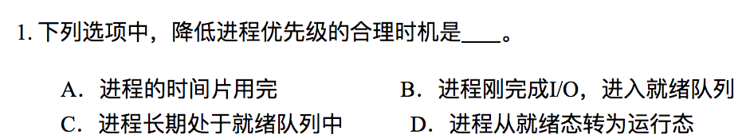
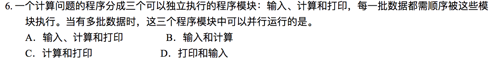
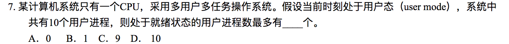
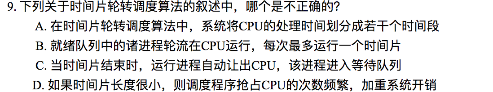
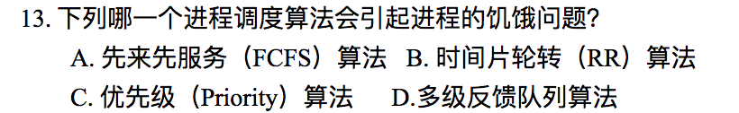

# Homework 2

**3150103823 韩熠星**

`A`

>B：已经进入就绪状态
 C：长期就绪就是等待
 D：刚运行就降低，有可能被抢断

 

`C`：V操作作使信号量+1，加完之后非正说明等待队列里有进程在等待，调用wakeup唤醒一个等待进程

>D：时间片用完会从【执行状态】回到【就绪状态】，而不是进到【阻塞状态】

 

`B`:进程具有并发性，也可以有多个进程运行

 

`A`：应为进程

 

`A`

 

`A`

 

`C`

 

`C`
J1: (1.5+2)/2 = 1.75
J2: (1+1)/1 = 2
J3: (0+0.25)/0.25 = 1

 

`C`：进入就绪队列，不是等待队列

 

`C`

 

`D`： 时间片轮转法和先来先服务算法都是用户感觉公平的方法，并未考虑进程等待时间和执行时间，而短进程优先考虑的是进程执行时间。

 

`C`：时间片轮转多用在分时系统中

 

`C`

 
