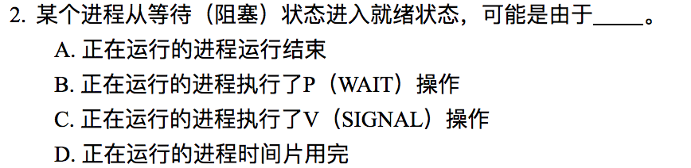
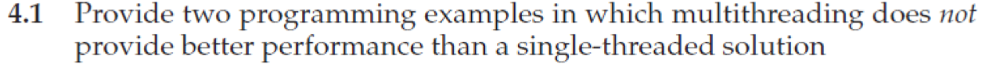
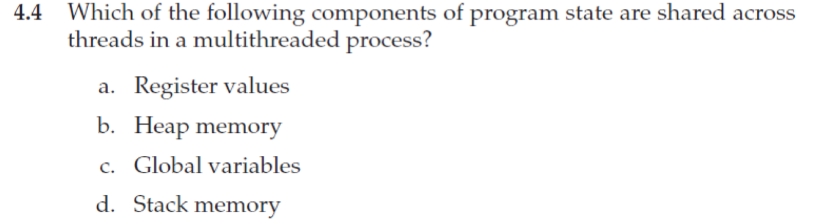

# Homework 2

**3150103823 韩熠星**

`A`

>B：已经进入就绪状态
 C：长期就绪就是等待
 D：刚运行就降低，有可能被抢断

 

`C`：V操作作使信号量+1，加完之后非正说明等待队列里有进程在等待，调用wakeup唤醒一个等待进程

>D：时间片用完会从【执行状态】回到【就绪状态】，而不是进到【阻塞状态】

 

`B`:进程具有并发性，也可以有多个进程运行

 

`A`：应为进程

 

`A`

 

`A`

 

`C`

 

`C`
J1: (1.5+2)/2 = 1.75
J2: (1+1)/1 = 2
J3: (0+0.25)/0.25 = 1

 

`C`：进入就绪队列，不是等待队列

 

`C`

 

`D`： 时间片轮转法和先来先服务算法都是用户感觉公平的方法，并未考虑进程等待时间和执行时间，而短进程优先考虑的是进程执行时间。

 

`C`：时间片轮转多用在分时系统中

 

`C`

 

（1）当运行进程因 I/O 而阻塞。这时候进程会从运行状态转到等待状态。发生变迁3。当高就绪队列为空时会发生变迁4。当等待时间已经发生时，会发生变迁6。

（2）

`a.3->5：` 可能会发生，当因I/O阻塞而等待时，高有限就绪为空时，就会发生

`b.6->4：` 不是因果变迁，不会发生

`c.6->7：` 可能会发生，当高低优先级就绪都为空时，运行结束

（3）

`调度策略：`当有多个就绪队列，而且优先级不同时，系统会优先照顾 I/O 吞吐量大的进程，高优先就绪队列被调度的机会比较大，但是一旦被调度，得到的时间片会比较小。而低优先就绪队列进程被调度的机会小，但是一旦被调度，得到的时间片会比较大。

`调度效果：`当进程被调度后，优先级会降低，会进入低优先就绪队列。而处于低优先就绪队列的进程，优先级会随着时间的增加而增大。有可能会进入高优先就绪队列。

 

场景：进程A下CPU，进程B上CPU

1. 保存进程A的上下文环境（程序计数器，程序状态字，其他寄存器…）
2. 用新状态和其他相关信息更新进程A的PCB
3. 把进程A移至合适的队列（就绪，阻塞…）
4. 将进程B的状态设置为运行态
5. 从进程B的PCB中恢复上下文（程序计数器，程序状态字，其他寄存器…）

>PCB（进程控制块）：为了描述控制进程的运行，系统中存放进程的管理和控制信息的数据结构
> 上下文切换：将CPU切换到另一个进程需要保存当前进程的状态并恢复另一个进程的状态。

 

 

 

**The operating system must save the state of the currently running process and restore the state of the process scheduled to be run next.**

[与15题相同](#15)

Saving the state of a process typically includes thevalues of all the CPU registers in addition to memory allocation.

Context switches must also perform many architecture-specific operations,including flushing data and instruction caches.

 

1. Any kind of sequential program is not a good candidate to be threaded. `e.g. Calculating personal income tax`

2. A program must closely monitor its own working space such as open files, environment variables, and current working directory. `e.g. Calculate Fibonacci`

 

在程序可能遭受频繁页缺失或必须等待其他系统事件的情况下，即使在单处理器系统上，多线程解决方案也会表现更好。

 

`b, c`

The threads of a multithreaded process share `heap memory` and `global variables`. Each thread has its separate set of `register values` and a `separate stack`.

 

`a:`当内核线程的数量小于处理器的数量时，由于调度程序仅将内核线程映射到处理器而不将用户级线程映射到处理器，因此一些处理器将保持空闲

`b:`当内核线程的数量等于处理器的数量，则可能同时使用所有处理器。 但是，当一个内核线程内核中的块由于页缺失或在调用系统调用时，相应的处理器将保持空闲状态。

`c:`当存在比处理器更多的内核线程时，可以交换阻塞的内核线程以支持另一个准备执行的内核线程，从而提高多处理器系统的利用率。

 

[与16题相同](#16)

 

`a, d`

 

`时间片为1ms：`无论调度哪个进程，调度程序都会为每个上下文切换产生0.1ms的上下文切换成本。

**CPU利用率为1 / 1.1 * 100 = 91％**

`时间片为10ms：`I/O绑定任务在耗尽仅1毫秒的时间片后才会产生上下文切换。 循环所有进程所需的时间是10 * 1.1 + 10.1（因为每个I/O绑定任务执行1ms然后引发上下文切换任务，而CPU绑定任务执行10ms之后才会发生上下文切换）。

**CPU利用率为20 / 21.1 * 100 = 94％。**

 

`a. FCFS:` discriminates against short jobs since any short jobs arriving after long jobs will have a longer waiting time.

`b. RR:` treats all jobs equally (giving them equal bursts of CPU time) , so short jobs will be able to leave the system faster since they will finish first.

`c. Multilevel feedback queues—work:` similar to the RR algorithmthey discriminate favorably toward short jobs.

 