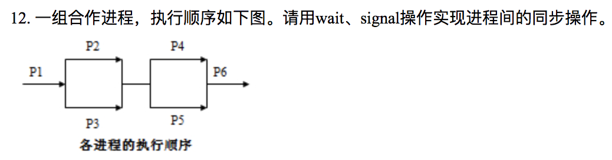

# Homework 3

**3150103823 韩熠星**


`B`：初始值3，当前1，也就是有两个进程正在占用资源，还可以进入一个，没有进程等待。

<br>


`C`

<br>


`C`：ｖ操作的作用是归还资源，将所申请的资源数加一，然后判断资源数是否小于等于０，若小于等于０说明有进程阻塞在当前资源上，唤醒一个当前资源链表中的进程。

<br>


`B`

<br>


`A`

<br>


`D`

<br>


`C`

<br>


`B`

<br>


`A`

<br>


`D`

<br>


`信号量mutex`：是保证各生产者进程和消费者进程对缓冲池的互斥访问。

`信号量empty和full`：资源信号量，它们分别对应于缓冲池中的空闲缓冲区和缓冲池中的产品，生产者需要通过 wait(empty)来申请使用空闲缓冲区，而消费者需要通过 wait(full)才能取得缓冲中的产品.**所以这两个信号量起着同步生产者和消费者的作用，它们保证生产者不会将产品存放到满缓冲区中，而消费者不会从空缓冲区中取产品。**

如果将两个 wait 操作，即 wait(full)和 wait(mutex)互换位置， 或者 wait(empty)和 wait(mutex)互换位置，都可能引起死锁。
>如果系统中缓冲区全满时，若一生产者进程先执行了 wait(mutex)操作并获得成功，当再执行wait(empty)操作时，它将因失败而进入阻塞状态，它期待消费者执行signal(empty)来唤醒自己，在此之前，它不可能执行signal(mutex)操作，从而使企图通过 wait(mutex)进入自己的临界区的其他生产者和所有的 消费者进程全部进入阻塞状态，系统进入死锁状态。

将signal(full)和 signal(mutex)互换位置，或者 signal(empty) 和 signal(mutex)互换位置，则不会引起死锁，其影响只是使某个临界资源的释放略为推迟一些。

<br>



可设置8个信号量 a、b、c、d、e、f、g、h，它们的初值均为0，而相应的进程可描述为（其中“…”表示进程原来的代码）：

```c
main()
cobegin{
  Process P1() {  …;        signal(a);  signal(b);              }
  Process P2() {  wait(a);  …;          signal(c);  signal(d);  }
  Process P3() {  wait(b);  …;          signal(e);  signal(f);  }
  Process P4() {  wait(c);  wait(e);    …;          signal(g);  }
  Process P5() {  wait(d);  wait(f);    …;          signal(h);  }
  Process P6() {  wait(g);  wait(h);    …;                      }
}coend
```

<br>


`1. 互斥`
P1,P2不会同时进入临界区，满足互斥条件。

`2. 有空进让`
设开始无进程在临界区中，P0执行`turn=0`进入临界区，当P0退出临界区时，执行`blocked[0]=flase`，使P1得以进入临界区，P1先执行的情况类似，所以满足有空进让的原则。

`3. 有限等待`
假定进程P0在临界区执行，进程P1申请进入临界区，则因进程P0会在有限时间内执行完并退出临界区，然后，将执行`blocked[0]=flase`，这使得`进程P1因blocked[0]值为0,而使turn值变为1`,立即可进入临界区。因而，能满足有限等待的原则。

**综上所述，该算法可以解决双进程临界区问题。**

<br>


```c
semaphore mutex=1;              // 用于互斥访问缓冲区
semaphore odd=0,even=0;
semaphore empty=N;
main()
cobegin{
    Process P1()
    while(True)
    {
        x=produce();             //生成一个数
        P(empty);                //判断缓冲区是否有空单元
        P(mutex);                //缓冲区是否被占用
        Put();
        V(mutex);                //释放缓冲区
        if(x%2==0)
            V(even);             //如果是偶数，向P3发出信号
        else
            V(odd);              //如果是奇数，向P2发出信号
    }
    Process P2()
    while(True)
    {
        P(odd);                  //收到P1发来的信号，已产生一个奇数
        P(mutex);                //缓冲区是否被占用
        getodd();
        V(mutex);                //释放缓冲区
        V(empty);                //向P1发信号，多出一个空单元
        countodd();
    }
    Process P3()
    while(True)
    {
        P(even);                 //收到P1发来的信号，已产生一个偶数
        P(mutext);               //缓冲区是否被占用
        geteven();
        V(mutex);                //释放缓冲区
        V(empty);                //向P1发信号，多出一个空单元
        counteven();
    }
}coend
```

<br>


