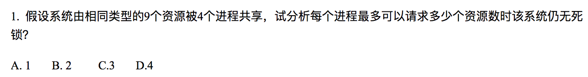
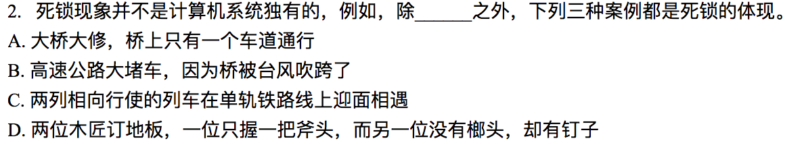
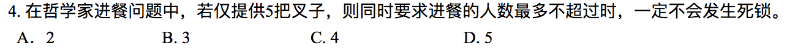
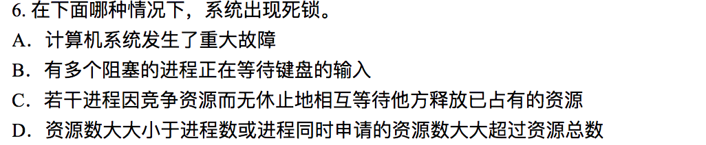
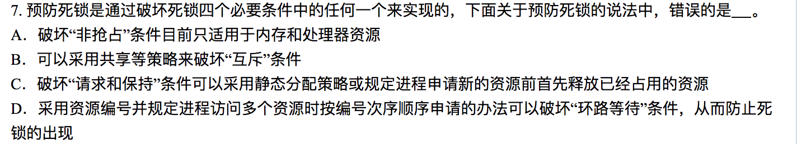
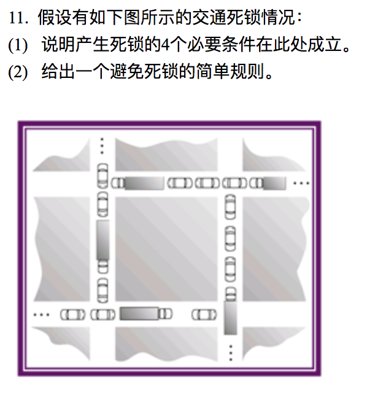
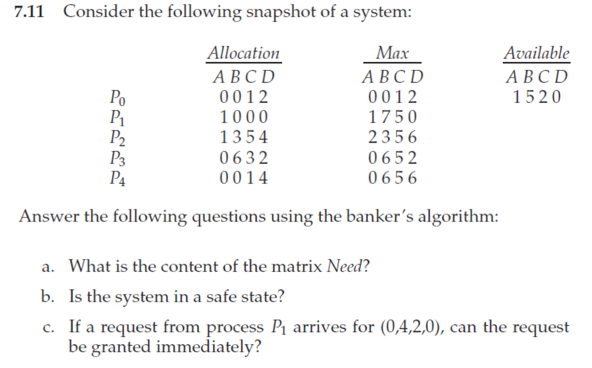

# Homework 4

**3150103823 韩熠星**

`C`
 

`B`
 

`B`
 

`C`
 

`B`
 

`C`
 

`A`
 

`D`
 

`D`
>银行家算法（Banker's Algorithm）是一个避免死锁（Deadlock）的著名算法，是由艾兹格·迪杰斯特拉在1965年为**T.H.E系统**设计的一种避免死锁产生的算法。它以银行借贷系统的分配策略为基础，判断并保证系统的安全运行。

 

`D`
 

 

 

 

 

 

 

 

