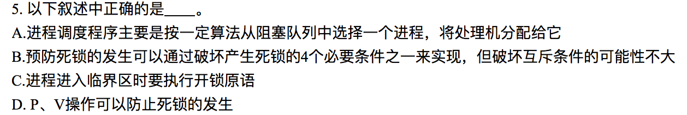
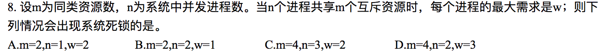
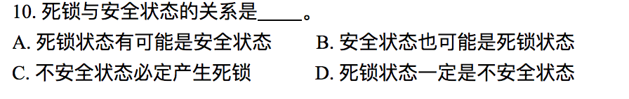
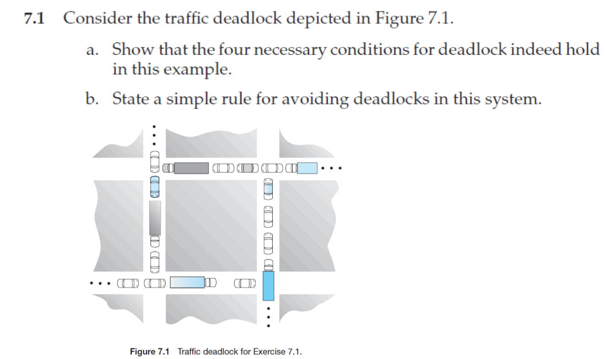
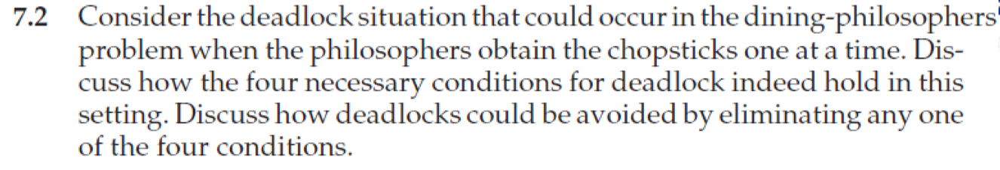
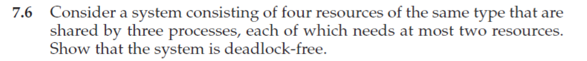

# Homework 4

**3150103823 韩熠星**

`C`
 

`B`
 

`B`
 

`C`
 

`B`
 

`C`
 

`A`
 

`D`
 

`D`
>银行家算法（Banker's Algorithm）是一个避免死锁（Deadlock）的著名算法，是由艾兹格·迪杰斯特拉在1965年为**T.H.E系统**设计的一种避免死锁产生的算法。它以银行借贷系统的分配策略为基础，判断并保证系统的安全运行。

 

`D`
 

（1）在此处，产生死锁的四个必要条件为：

`1.互斥:`每个车道的每段道路只能被一辆车占用。

`2.请求与保持:`每个车队占用了一个车道，并请求前方的车道，即使需等待前方车道上的车队驶离，它仍将持有已占用的车道。

`3.不抢占:`在前方的车道被其它车队占用时，因为是单车道，而其它车队又不会后退，所以无法从其它车队处抢占车道。

`4.环路等待:`向东行驶的车队等待向北行驶的车队让出车道，向北行驶的车队等待向西行驶的车队让出车道，向西行驶的车队等待向南行驶的车队让出车道，而向南行驶的车队则等待向东行驶的车队让出车道。**故存在一循环等待链。**

（2）`增加约束条件：`只有前方两个路口都空闲时，才能占用第一个路口。即可避免死锁的产生。

 

（1） `各进程尚需资源数 = 最大请求资源 - 已分配资源。`结果如下表所示：

| |A|B|C|D|
|--|--|--|--|--|
|P0|0|0|0|0|
|P1|0|7|5|0|
|P2|1|0|0|2|
|P3|0|0|2|0|
|P4|0|6|4|2|

(2) **系统是安全的** 可以找到一个安全序列：`<P0, P2, P3, P4, P1>`

(3) 分配资源给P1后，剩余资源为`（1, 1, 0, 0）`。可以找到一个安全序列`<P0, P2, P3, P4, P1>`。所以系统是安全的

 

[Same as question 11](#11)

 

Deadlock is possible because the four necessary conditions hold in the following manner:

1. Mutual exclusion is required for chopsticks
2. The philosophers tend to hold onto the chopstick in hand while they wait for the other chopstick
3. There is no preemption of chopsticks in the sense that a chopstick allocated to a philosopher cannot be forcibly taken away
4. There is a possibility of circular wait.

Deadlocks could be avoided by overcoming the conditions in the following manner:

1. Allow simultaneous sharing of chopsticks
2. Have the philosophers relinquish the first chopstick if they are unable to obtain the other chopstick,
3. Allow for chopsticks to be forcibly taken away if a philosopher has had a chopstick for a long period of time
4. Enforce a numbering of the chopsticks and always obtain the lower numbered chopstick before obtaining the higher numbered one.

 

Suppose the system is deadlocked.

Each process is holding one resource and is waiting for one more. But there are three processes and four resources, one process must be able to obtain two resources. This process requires no more resources and, therefore it will return its resources when done.

So the system is deadlock-free.

 

From the conditions, we can get that:

$$\sum\nolimits_{i=1}^nNeed_i+ \sum\nolimits_{i=1}^nAllocation_i<m+n=\sum\nolimits_{i=1}^nMax_i$$
$$\sum\nolimits_{i=1}^nNeed_i<n$$

So there exists a process $p_i$ such that  $Need_i = 0$. Since $Max_i ≥ 1$ it follows that $p_i$ has at least one resource that it can release.

That's why the system cannot be in a deadlock state.

 

[Same as question 12](#12)

 

