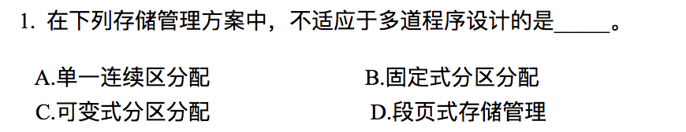
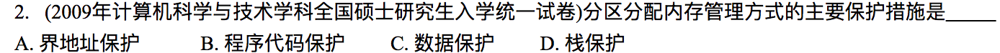
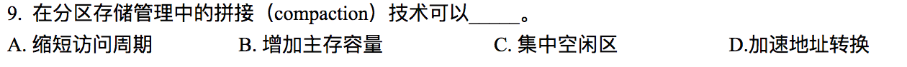
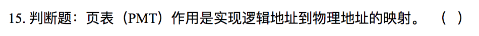
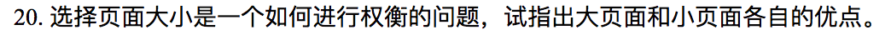

# Homework 5

**3150103823 韩熠星**

`A`
 

`A`
 

`B`
 

`D`
 

`A`
 

`B`
 

`A`
 

`C`
 

`C`
 

`T`
 

`覆盖和交换技术解决的问题：`在多道程序环境下用来扩充内存，打破了必须将一个进程的全部信息装入主存后才能运行的限制。

`特点:`交换技术主要是在不同进程（或作业）之间进行，而覆盖则是用于同一程序或进程中。

由于覆盖技术要求给出程序段之间的覆盖结构，使得其对用户和程序员不透明，所以对主存无法存放用户程序的矛盾，现代操作系统是通过虚拟内存技术来解决的，覆盖技术则已成为历史；而交换技术在现代操作系统中仍具有较强的生命力。

>覆盖技术：把程序划分为若干个功能上相对独立的程序段，按照其自身的逻辑结构使那些不会同时运行的程序段共享同一块内存区域。程序段先保存在磁盘上，当有关程序的前一部分执行结束后，把后续程序段调入内存，覆盖前面的程序段。

>交换技术：在分时系统中，用户的进程比内存能容纳的数量更多，系统将那些不再运行的进程或某一部分调出内存，暂时放在外存上的一个后备存储区，通常称为交换区，当需要运行这些进程时，再将它们装入内存

 

`C`
 

`A`
 

`T` ：通过页表机制，在内存中找到最终的块基地址后，与逻辑地址的剩余部分（即偏移地址）组合，就完成了逻辑地址到物理地址的转换。

 

`13， 15`

逻辑地址：`8 * 1024 = 2^13`（所以逻辑地址的后13位为页内地址）

物理地址：`32 * 1024 = 2^15`

所以逻辑有效位是13，物理有效位是15.

 

(1) `400ns:` 200ns访问页表，200ns在内存中找到数据。

(2) 0.85*(200+20）+ 0.15*(200+20+200+20) = `253ns`

 

页面大小为1KB，在虚地址中有10个二进制位，用户地址空间有32页，虚页号占5个二进制位，因此虚地址长度为15位。主存为16KB，所以物理地址为14位。

0AC5H的二进制形式是000101011000101，虚页号为00010即十进制的2，由上表可知是4号物理块，即0100，所以相应物理地址为12C5H。

1AC5H的二进制形式为001101011000101，虚页号为00110即十进制的6，由表知没有第6页，将发生缺页中断。系统从外存中把第6页调入内存，然后更新页表。

 

(1)

根据虚地址的页号查快表，如果快表中有此页号，读出快表中此页对应的页框号，并与虚地址的页内偏移地址结合形成物理地址。

如果快表中没有相应的页号，则查页表。如果该页在页表中的状态为1，说明该页在主存，从页表中读出该页对应的页框号，形成物理地址，同时将此页表项登记到快表中。

如果该页在页表中的状态为0，说明该页不在内存，产生缺页中断。系统处理缺页中断时，查看是否有空闲的页框。若有则直接将该页装入空闲的页框；若没有，则按NRU算法淘汰一页再装入内存；然后在页表中填上它所占用的页框号并修改状态位，继续进行地址转换过程

(2)

`5499：`5499/1024=5...429—对应物理块号为0，所以物理地址为`429`

`2221：`2221/1024=2...173-该页不存在内存，淘汰第1页，所以物理地址为7*1024+172=`7341`

 

`大页面：`当引用同一页面内其他数据时，地址转移的速度会很快。

`小页面：`减少内部碎片（浪费），不过需要更大的页表

 

