# Homework 6

**3150103823 韩熠星**

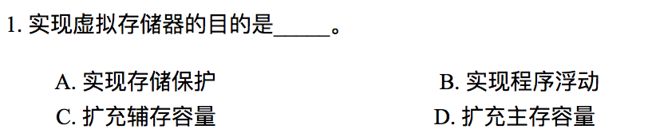

`D`
 

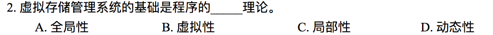

`C`
 

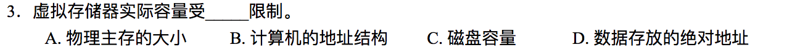

`B`
 

`D`:缺页中断是因为所需页面不在内存，向CPU发出中断请求，暂停现行程序，执行缺页中断处理程序，然后返回到原来的指令执行。所以，缺页中断是程序中断。

>程序中断：CPU在执行程序的过程中，因出现某种随机事件而收到中断请求，暂时停止现行程序的执行，转去执行一段中断服务程序，以处理该事件，并在处理完毕后自动恢复程序的执行。
 

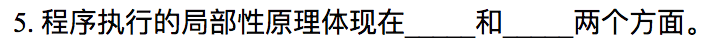

`时间局部性：`被引用过一次的存储器位置在未来会被多次引用

`空间局部性：`如果一个存储器的位置被引用，那么将来他附近的位置也会被引用。

 

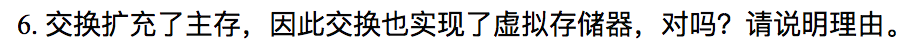

`不对。`

交换是把各个进程完整地调入内存，运行一段时间，再放回磁盘上。虚拟存储器是使进程在只有一部分在内存的情况下也能运行。

交换是把整个进程换入换出主存。而虚拟存储器的基本思想是程序的大小可以超过物理内存的大小，操作系统把程序的一部分调入主存来运行，而把其他部分保留在磁盘上。

故交换并未实现虚拟存储器。
 

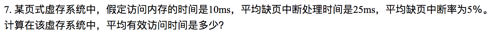

 

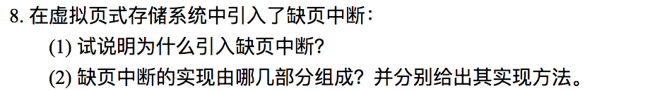

 

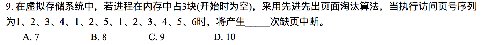

`B`
 

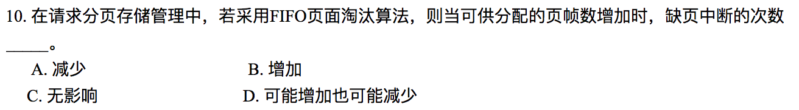

`D`
 

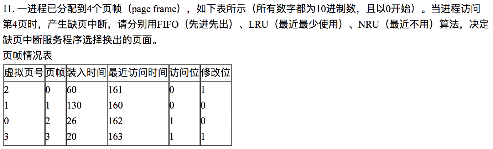

 

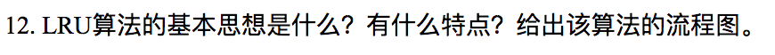

LRU的基本思想是：

其特点为：

流程图如下：
 

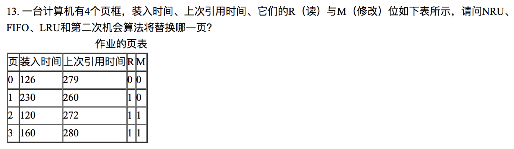

 

