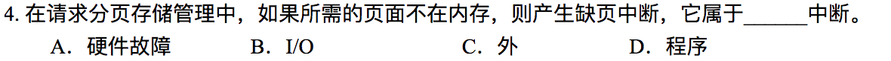

# Homework 6

**3150103823 韩熠星**

`D`
 

`C`
 

`B`
 

`D`:缺页中断是因为所需页面不在内存，向CPU发出中断请求，暂停现行程序，执行缺页中断处理程序，然后返回到原来的指令执行。所以，缺页中断是程序中断。

>程序中断：CPU在执行程序的过程中，因出现某种随机事件而收到中断请求，暂时停止现行程序的执行，转去执行一段中断服务程序，以处理该事件，并在处理完毕后自动恢复程序的执行。
 

`时间局部性：`被引用过一次的存储器位置在未来会被多次引用

`空间局部性：`如果一个存储器的位置被引用，那么将来他附近的位置也会被引用。

 

`不对。`

交换是把各个进程完整地调入内存，运行一段时间，再放回磁盘上。虚拟存储器是使进程在只有一部分在内存的情况下也能运行。

交换是把整个进程换入换出主存。而虚拟存储器的基本思想是程序的大小可以超过物理内存的大小，操作系统把程序的一部分调入主存来运行，而把其他部分保留在磁盘上。

故交换并未实现虚拟存储器。
 

**访问页在内存**，一次访问时间10+10=20ms

**访问页不在内存**，一次访问时间10(访问内存页表)+25(中断处理)+10(访问内存页表)+10(访问内存)=55ms

故平均有效访问时间:`20*(1-5%)+55*5%=21.75ms`

 

（1）

虚拟页式存储系统是在页式存储体统的基础上实现虚拟存储器的,也即一作业在执行时并不是所有的页面均放入主存，那么当访问的页面不在主存时,则产生中断并由系统响应中断将该缺页由辅存调至主存,然后恢复中断并继续执行。

所以对于虚拟页式存储系统,系统必须引入相应的缺页中断

（2）

+ `硬件方面`

  CPU在执行一条指令时首先形成操作数的有效地址,然后计算页号,检查页表看该页是否在主存中.如果该页在主存则进行地址变换,按变换后的地址取出操作数并完成该指令的功能,然后继续执行下一条指令,如果该页不在主存,则引起缺页中断并进入缺页中断处理程序

+ `软件方面`

  在中断处理程序中,首先利用存储器分块表（MBT）检查主存是否有空闲块,如果没有则选择主存中的一页淘汰(该页被修改过还需写入辅存),并修改页表（PMT）和存储器分块表，此时便出现了空闲块。在空闲块的情况下，系统根据页表中提供的该页磁盘地址将该页调入主存的空闲块中，然后修改PMT和ＭBT，最后再重新执行刚才被中断的指令

 

`B`
 

`D`
 

`FIFO算法`会换出`页2`（最早装入）

`LRU算法`会换出`页1`（最近最少使用）

`NRU算法`会换出`页2`（最近不用）

 

`LRU的基本思想：`根据局部性原理,按照一个作业在执行过程中已执行过的页面访问踪迹来推测未来的页面走向，即认为过去一段时间里不曾被访问过的页面,在最近的将来可能也不会再被访问。

`其特点为`：需要置换一个页面时,选择在最近一段时间最久不用的页面予以淘汰。

`流程图如下：`

 

`NRU算法`将替换0类编号页——`页0`；

`FIFO算法`将替换最早装入页——`页2`

`LRU算法`将替换最近未被使用页——`页1`

`第二次机会算法`将替换载入时间早且R位为零的页——`页0`。

