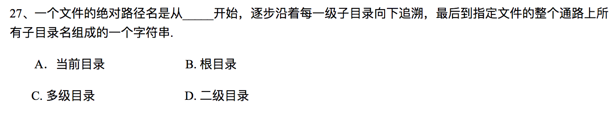

# Homework 7

**3150103823 韩熠星**

`A`：文件系统是对文件存储设备的空间进行组织、分配，负责文件存储并且对存入的文件进行保护和检索的系统。
 

`A`：构成流式文件的基本单位是字符或字节，如ASCII码文件或者二进制文件，构成记录式文件的基本单位是记录，一条记录又由若干个数据项构成。
 

`A`
 

`A`
 

`D`

每块索引地址占`4B`，物理块大小为`2KB`，则一个索引物理块可存放512个物理块的索引，两级索引则可存放`512*512`个物理块的索引，每个物理块大小为`2KB`，则文件的最大尺寸为`512*512*2KB=512MB`。
 

`A`：可能文件末尾处的空块已经分配给了别的文件
 

`D`
 

`B`
 

`B`
 

`C`
 

`A`
 

`C`
 

`B`
 

`C`
 

`A`
 

(1) `A`

(2) `B`

(3) `A`

(4) `E`

 

`C`
 

(1) `C`

(2) `C`：二级索引取需要访问2次，存需要一次，共需要三次
 

`A`
 

`B`
 

`B`
 

`D`
 

`A`

>位示图是利用二进制的一位来表示磁盘中的一个盘块的使用情况。当其值为“0”时，表示对应的盘块空闲；为“1”时，表示已经分配。有的系统把"0"作为盘块已分配的标记，把“1”作为空闲标志。

 

`A`
 

`B`
 

`C`
 

`B`
 

`连续分配`

(1) 用 `512` 去除逻辑地址，`X` 和 `Y` 分别表示得到的整数和余数。将 `X` 加上 `Z` 得到`物理块号`，`Y` 为`块内位移`

(2) 读1个物理块

`链接分配`

（1）用 `511` 去除逻辑地址，`X` 和 `Y` 分别表示得到的整数和余数。查找链表到第 `X+1`块, `Y+1` 为`块内位移`

（2）读4个物理块

`索引分配`

（1）用 `512` 去除逻辑地址，`X` 和 `Y` 分别表示得到的整数和余数。把索引块读入内存中，则物理块地址存放在索引块在第 `X` 位中，  `Y` 为`块内位移`

（2）读2个物理块

 

（1）

+ `连续分配`：理论上是不受限制，可大到整个磁盘文件区。
+ `链接分配`：由于块的地址为4字节，所以能表示的最多块数为 `2^32=4G`，而每个盘块中存放文件大小为`4092字节`。

  所以链接分配可管理的最大文件为：`4G×4092B=16368GB`
+ `链接索引`：由于块的地址为4字节，所以最多的链接索引块数为 `2^32=4G`，而每个索引块有1023个文件块地址的指针，盘块大小为`4KB`。假设最多有n个索引块，则1023×n+n=2^32，n=2^22

  所以链接索引分配可管理的最大文件为：`4M*1023*4KB=16368GB`
+ `二级索引`：由于盘块大小为`4KB`，每个地址用`4B`表示，一个盘块可存`1K`个索引表目。

  所以二级索引可管理的最大文件容量为`4KB×1K×1K＝4GB`。
+ `LINUX混合分配`：LINUX的直接地址指针有12个，还有一个一级索引，一个二级索引，一个三级索引。

  所以LINUX混合分配可管理的最大文件为`48KB＋4MB+4GB＋4TB -约为4TB` 。

(2)

+ `连续分配`：对大小两个文件都只需在文件控制块FCB中设两项：`首块物理块块号`和`文件总块数`，**不需专用块来记录文件的物理地址**。
+ `链接分配`：对大小两个文件都只需在文件控制块FCB中设两项：`首块物理块块号`和`末块物理块块号`，**同时在文件的每个物理块中设置存放下一个块号的指针**。
+ `链接索引`：

  对20KB小文件只有5个物理块大小，所以只需`1块专用物理块`来作索引块，用来保存文件的各个物理块地址。

  对于20MB大文件共有5K个物理块，由于链接索引的每个索引块只能保存（1K－1）个文件物理块地址（另有一个表目存放下一个索引块指针），所以需要`6块专用物理块`来作链接索引块，用于保存文件各个的物理地址。
+ `二级索引`：对大小文件都固定要用二级索引

  + 对20KB小文件，用一个物理块作第一级索引，用另一块作二级索引，共用`2块专用物理块`作索引块

  + 对于20MB大文件，用一块作第一级索引，用5块作第二级索引，共用`6块专用物理块`作索引块。

+ `LINUX的混合分配`：
  对20KB小文件只需在文件控制块FCB的`i_addr[15]`中使用前5个表目存放文件的物理块号，**不需专用物理块**。

  对20MB大文件，FCB的`i_addr[15]`中使用前12个表目存放大文件前12块物理块块号（48K），用一级索引块一块保存大文件接着的1K块块号（4M），剩下还有不到16M，还要用二级索引存大文件以后的块号，二级索引使用第一级索引1块，第二级索引4块（4KB×1K×4=16M）。所以总共也需要`6块专用物理块`来存放文件物理地址。

(3)

+ `连续分配`：为读大文件前面和后面信息都需先计算信息在文件中相对块数，前面信息相对逻辑块号为5.5K/4K=1（从0开始编号），后面信息相对逻辑块号为`(16M＋5.5K)/4K=4097`。再计算物理块号＝文件首块号＋相对逻辑块号，最后花1次盘I/O操作读出该块信息。

  所以读前5.5K需要`2次盘I/O`，后16M+5.5K需要`4098次盘I/O`

+ `链接分配`：同连续分配，读前5.5K需要`2次盘I/O`，后16M+5.5K需要`4098次盘I/O`
+ `链接索引`：

  + 读前5.5K需要`2次盘I／O`操作。

  + 读后16MB+5.5KB处的信息，`(16MB+5.5KB)/(4KB×1023)=4`,需要先花5次盘I／O操作依次读出各索引块，才能得到信息所在块的块号，再花1次盘I/O操作读出该块信息。共需要`6次盘I/O`操作。
+ `二级索引`：为读大文件前面和后面信息的操作相同，首先进行1次盘I/O读第一级索引块，然后根据它的相对逻辑块号计算应该读第二级索引块，

  第一级索引块`表目号=相对逻辑块号／1K`，对文件前面信息`1／1K＝0`，对文件后面信息`4097／1K＝4`，第二次根据第一级索引块的相应表目内容又花1次盘I/O读第二级索引块，得到信息所在块块号，再花1次盘I／O读出信息所在盘块

  所以读取前面或后面处信息都只需要`3次盘I／O`操作。
+ `LINUX混合分配`

  + 读前面5.5KB处信息：先根据它的相对逻辑块号，在内存文件控制块FCB的`i_addr`第二个表目中读取信息所在块块号，只花费`1次盘I/O`操作即可读出该块信息。

  + 读后在16MB＋5.5KB信息：根据它的相对逻辑块号判断要读的信息是在二级索引管理范围内，先根据`i_addr`内容花一次盘I/O操作读出第一级索引块，再计算信息所在块的索引块号在第一级索引块的表目号为`（4097-12-1024）／1024＝2`，根据第一级索引块第3个表目内容再花费1次盘I/O操作，读出第二级索引块，就可以得到信息所在块块号，最后花一次盘I/O读出信息所在盘块。所以总共需要`3次盘I/O操作`。

